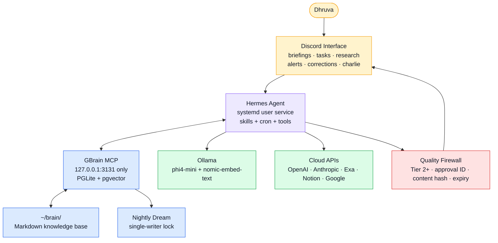

# DhruvaOS Mark 2

> A local-first personal AI operating system for Dhruva Vutukury: Discord interface,
> Hermes runtime, GBrain memory, model routing, daily briefings, research, tasks,
> corrections, and a hard approval gate before any third-party-readable text leaves the system.

[](#build-phases)
[](#quality-firewall)
[](https://github.com/NousResearch/hermes-agent)
[](https://github.com/garrytan/gbrain)
[](#deployment-surface)
[](#cost-shape)

---


## Documentation

- [Repository Map](docs/repo-map.md)

## Mission Control

| Lane | Current state | What matters |
|------|---------------|--------------|
| 🟢 **Core runtime** | Hermes gateway + GBrain MCP documented as deployed | Verify live host with `scripts/health-check.sh` before relying on ops claims |
| 🟢 **Memory** | GBrain PGLite + `~/brain/` markdown | All writes must share `~/.gbrain/gbrain-write.lock` |
| 🟡 **Inbox / tasks** | Phase 2 skills deployed | Notion schema + real 8am briefing still need live verification |
| 🟡 **Command skills** | `/task`, `/research`, `/correct` deployed | Command tests and quality firewall gate still pending |
| 🟢 **Dream cycle** | Running nightly (3am); stale-fact-rewrite at 3:30am | Phases: backfill, enrich_thin, skillopt all enabled; 14 chunks embedded on first live run |
| 🔴 **Outbound actions** | Phase 5 stubs only | Do not enable until P3.3 approval gate passes end-to-end |
| 🟢 **Remote access** | Tailscale authenticated (100.119.229.11) | LAN fallback: 10.0.0.31 |

**Canonical docs:** start with [CLAUDE.md](CLAUDE.md), then load subsystem docs only when needed:
[Hermes](hermes/CLAUDE.md), [GBrain](gbrain/CLAUDE.md), [Skills](skills/CLAUDE.md),
[Discord](discord/CLAUDE.md), [Brain](brain/CLAUDE.md).

---

## What It Does

| Moment | Drew should do |
|--------|----------------|
| 🌅 8am | Post morning briefing: calendar, email action items, tasks, research |
| 📬 Unread email | Classify, summarize, and surface actions without replying |
| 🔎 `/research agent architectures` | Search GBrain first, fetch current sources, write a durable research note |
| ✅ `/task submit homework due Friday` | Add to Notion and `~/brain/projects/tasks-inbox.md` |
| 🧠 `/correct keep email summaries under 3 bullets` | Persist a preference unless it conflicts with safety policy |
| 🚦 Outbound draft | Preview in `#corrections`, require exact approval, then execute |
| 🌙 3am | Run GBrain dream cycle (all phases enabled, including backfill + enrich_thin) |
| 🌙 3:30am | Run stale-fact-rewrite: phi4-mini evaluates facts, expires stale ones, inserts updated |

---

## Architecture



### Design Bet

Mark 1 planned custom infrastructure: FastAPI orchestration, Mem0, Qdrant, Graphify, and
bespoke agents. Mark 2 installs the hard parts instead: Hermes for the self-improving runtime
and GBrain for compounding memory. The engineering work shifts to skills, contracts, verification,
and preserving the approval boundary.

---

## Quality Firewall

No cost optimization, correction, convenience shortcut, or automation may bypass this:

```text
Any text a human other than Dhruva will read
  -> Tier 2+ model minimum
  -> preview in #corrections
  -> approval_id + destination + content SHA-256 + expiry
  -> exact Dhruva approver ID
  -> execute only after matching approval
  -> log approval or denial
```

Internal Discord is not public, but it is still third-party infrastructure. Email triage and
briefings should minimize personal data, avoid full email bodies, and assume Discord history persists.

---

## Build Phases

| Phase | Name | Status | Gate |
|-------|------|--------|------|
| 0 | Infrastructure | ✅ Complete | Installed and hardened; obsolete one-shot script now fails closed |
| 1 | Alive | ✅ Complete | Discord response, GBrain connected, security baseline |
| 2 | Inbox | 🟡 Deployed, not fully verified | Notion schema + first real briefing |
| 3 | Menial tasks | 🟡 Active | `/task`, `/research`, `/correct`, then P3.3 firewall test |
| 4 | Self-improving | 🟡 Active | Dream running nightly, stale-fact-rewrite deployed; P4.7 brain health + skill authoring remain |
| 5 | Network | ⬜ Blocked on firewall | LinkedIn, GitHub, personal site |
| 6 | Voice + mobile | ⬜ Future | TTS/STT/iPhone automations |

**Important distinction:** “deployed” means the skill files exist and are configured. “Verified”
means a live end-to-end run has passed and the result was inspected.

---

## Model Routing

| Tier | Model | Use | Approval |
|------|-------|-----|----------|
| 0 | `phi4-mini` via Ollama | local parsing, formatting, classification | never outbound |
| 1 | `gpt-4o-mini-2024-07-18` | research, planning, mid-complexity | internal only |
| 1 fallback | `deepseek/deepseek-v3` via OpenRouter | after OpenAI credit threshold | internal only |
| 2 | `claude-sonnet-4-6` | outbound writing, review, complex reasoning | required for outbound |
| 3 | `claude-opus-4-8` | orchestration, high-stakes decisions | required for outbound |

Current-source note: Hermes release metadata changes quickly. Public release trackers showed
`v2026.5.29.2` as the latest tag during this review; the live Omen install must be checked with
`hermes --version` before pinning docs to a local version.

---

## Skill Surface

| Skill | Status | Writes | Notes |
|-------|--------|--------|-------|
| `calendar-read` | deployed | none | read-only agenda |
| `email-triage` | deployed | Gmail read-state | internal digest with data minimization |
| `morning-briefing` | deployed | `daily/briefing-*.md` | 8am live run pending verification |
| `evening-briefing` | deployed | `daily/recap-*.md` | 9pm recap |
| `task-prioritization` | deployed | `projects/tasks.md` | only canonical writer of ranked tasks |
| `add-task` | deployed | `projects/tasks-inbox.md` | JSON-safe Notion call + locked GBrain ingest |
| `research-synthesis` | deployed | `resources/research-*.md` | safe slug + locked GBrain ingest |
| `correction-handler` | deployed | `concepts/corrections.md` | immutable-policy filter |
| `stale-fact-rewrite` | deployed | none (updates via gbrain CLI) | nightly 3:30am, phi4-mini eval, Hermes cron |
| `xposteros-control` | deployed | XPosterOS API (dry-run) | controls local XPosterOS service |
| `github-update` | deployed (quality firewall test) | external | Phase 5 — requires P3.3 gate pass |
| `linkedin-post` | stub | external | Phase 5, blocked on firewall gate |

Hermes skill format is `skills/dhruvaos/<name>/SKILL.md` with YAML frontmatter. The older
`skills/*.yaml` files are reference stubs and should not be treated as the deployed source.

---

## Deployment Surface

| Component | Runtime | Safety rule |
|-----------|---------|-------------|
| Hermes gateway | `systemctl --user status hermes-gateway` | runs as `dhruva`, never root |
| GBrain MCP | PM2, HTTP mode | bind `127.0.0.1:3131` only; no Cloudflare exposure |
| GBrain DB | `~/.gbrain/brain.pglite/` | never commit, never write concurrently |
| Brain markdown | `~/brain/` | frontmatter required for useful indexing |
| Ollama | systemd | local Tier 0 + embeddings |
| Tailscale | systemd | SSH address lives in private ops notes |
| Cloudflare Tunnel | optional | only for authenticated future HTTP surfaces, never GBrain MCP |

---

## Quick Commands

```bash
# Local repo checks
scripts/check-agents-drift.sh
bash -n scripts/*.sh
scripts/check-skill-contracts.py
uvx pytest skills/    # 94 tests across all deployed skills

# Omen health check, from this repo
ssh dhruva@<TAILSCALE_IP> 'bash -s' < scripts/health-check.sh

# Omen process status
pm2 list
systemctl --user status hermes-gateway
pm2 logs gbrain-mcp --lines 20

# GBrain safety
gbrain onboard --check --json
flock -n ~/.gbrain/gbrain-write.lock gbrain embed --stale
gbrain dream --dry-run
```

`scripts/phase0-setup.sh` is intentionally a guard now. It refuses to run because the old script
encoded obsolete deployment assumptions.

---

## Cost Shape

| Bucket | Expected cost |
|--------|---------------|
| Omen infrastructure | `$0/month` |
| Tier 0 local work | `$0` |
| OpenAI Tier 1 | low credit burn while credits last |
| Anthropic Tier 2/3 | main recurring cost, mostly outbound/review/orchestration |

See [COST.md](COST.md) for the detailed model and caching assumptions.

---

## Docs Map

| Document | Use when |
|----------|----------|
| [CLAUDE.md](CLAUDE.md) | grounding any agent |
| [AGENTS.md](AGENTS.md) | Codex/OpenCode adapter |
| [BUILD_PLAN.md](BUILD_PLAN.md) | phase gates and next work |
| [HANDOFF.md](HANDOFF.md) | subsystem contracts |
| [DEPLOYMENT.md](DEPLOYMENT.md) | Omen runbook |
| [ENVIRONMENT.md](ENVIRONMENT.md) | host setup and hardening |
| [MODEL_ROUTING.md](MODEL_ROUTING.md) | model tiers and firewall |
| [SKILLS.md](SKILLS.md) | skill catalog and trust model |
| [MEMORY.md](MEMORY.md) | GBrain and brain sync |
| [ARCHITECTURE.md](ARCHITECTURE.md) | system design |
| [decisions/](decisions/README.md) | ADRs |
| [wiki/](wiki/README.md) | operational notes |

---

*Engineered by [Dhruva Vutukury](https://github.com/Dhruva966), UCLA CS.*
