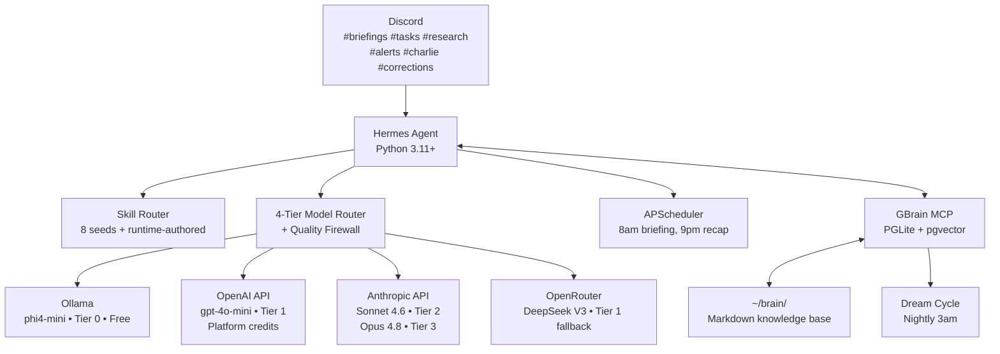

# DhruvaOS Mark 2

A 24/7 autonomous personal AI OS. Hermes Agent + GBrain. Jarvis-style. Runs on your Omen.

## System Flow



## Key Numbers

| Metric | Value |
|--------|-------|
| Infrastructure cost | $0/month (Omen local) |
| Year 1 total | ~$32-68/month (mostly Anthropic) |
| Tier 0 VRAM | 2.5 GB (3.5 GB free on RTX 2060) |
| OpenAI credits | ~$1,000 → estimated 2-3 years at moderate usage |
| Starting skills | 8 seeds |
| GBrain bundled skills | 43 |
| Hermes iteration cap | 90 per run |
| Max concurrent subagents | 3 (depth 2) |
| Brain persistence | `~/.gbrain/brain.db` (PGLite) |
| Dream cycle | Nightly 3am |

## Documents

| File | Purpose |
|------|---------|
| [CLAUDE.md](CLAUDE.md) | Root context — all agents read this first |
| [ARCHITECTURE.md](ARCHITECTURE.md) | System design, layer diagram, component mapping |
| [ENVIRONMENT.md](ENVIRONMENT.md) | Omen setup, runtimes, security hardening |
| [MODEL_ROUTING.md](MODEL_ROUTING.md) | 4-tier routing, quality firewall, config.yaml |
| [SKILLS.md](SKILLS.md) | Starting skills, trust model, authoring pattern |
| [MEMORY.md](MEMORY.md) | GBrain setup, Obsidian ingest, braindump guide |
| [BUILD_PLAN.md](BUILD_PLAN.md) | Phased rollout (P0–P6), parallel task safety |
| [COST.md](COST.md) | Year 1/2 cost model, credit burn rate |
| [VISION.md](VISION.md) | Jarvis north star — why this exists |
| [HANDOFF.md](HANDOFF.md) | Hermes↔GBrain data contracts |
| [DEPLOYMENT.md](DEPLOYMENT.md) | Omen setup runbook, VPS migration |
| [AGENTS.md](AGENTS.md) | Thin adapter for Codex, OpenCode, Antigravity — read CLAUDE.md first |

## Subsystem Docs

| File | Purpose |
|------|---------|
| [hermes/CLAUDE.md](hermes/CLAUDE.md) | Hermes skill development patterns |
| [gbrain/CLAUDE.md](gbrain/CLAUDE.md) | GBrain ingest, search, memory patterns |
| [skills/CLAUDE.md](skills/CLAUDE.md) | Skill authoring rules + trust gate |
| [brain/CLAUDE.md](brain/CLAUDE.md) | Brain content structure + writing conventions |
| [discord/CLAUDE.md](discord/CLAUDE.md) | Discord channel purposes + routing |

## Quick Start (Phase 0)

```bash
# 1. Create dedicated user
sudo useradd -m -s /bin/bash dhruvaos && sudo su - dhruvaos

# 2. Install runtimes
sudo apt install -y python3.11 python3.11-venv && pip install uv
curl -fsSL https://bun.sh/install | bash
curl https://raw.githubusercontent.com/nvm-sh/nvm/v0.39.0/install.sh | bash
nvm install 24 && npm install -g pm2

# 3. Install Ollama + phi4-mini (Tier 0)
curl -fsSL https://ollama.com/install.sh | sh
ollama pull phi4-mini

# 4. Install Hermes Agent
git clone https://github.com/NousResearch/hermes-agent ~/.hermes-src
cd ~/.hermes-src && uv pip install -e .

# 5. Install GBrain
bun install -g github:garrytan/gbrain && gbrain upgrade

# 6. Initialize brain
mkdir -p ~/brain/{people,companies,concepts,projects,daily,resources,UCLA,goals,charlie}
gbrain apply-migrations --yes
gbrain onboard --check --json

# 7. Start services
pm2 start "gbrain serve" --name gbrain-mcp
pm2 start "python ~/.hermes-src/run_agent.py" --name hermes
pm2 startup && pm2 save
```

Full setup: see [ENVIRONMENT.md](ENVIRONMENT.md) and [BUILD_PLAN.md](BUILD_PLAN.md).

## Useful Commands

```bash
# Status
pm2 list
pm2 logs hermes --lines 50

# GBrain
gbrain search "query"
gbrain think "trajectory query"
gbrain dream                        # run dream cycle manually
gbrain onboard --check --json      # health check

# Brain ingest
gbrain import ~/path --no-embed && gbrain embed --stale

# Skill management
ls ~/.hermes/skills/               # list all skills
pm2 restart hermes                 # reload skills after changes

# Security
auditctl -l                        # check audit rules
ufw status                         # check firewall rules
aa-status                          # check AppArmor status
```

## Discord Channels

| Channel | Purpose |
|---------|---------|
| `#briefings` | Morning/evening briefings, proactive updates |
| `#tasks` | Task list, prioritization, status |
| `#research` | Research synthesis outputs |
| `#alerts` | Urgent notifications |
| `#charlie` | Charlie's Cleaners (stub — future) |
| `#corrections` | **Outbound approval gate** — all outbound previews appear here |
