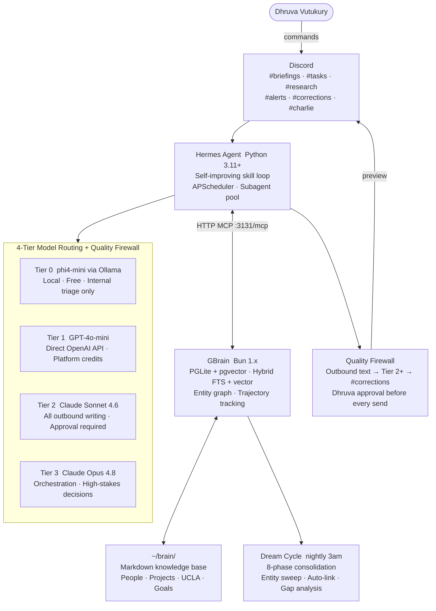

# DhruvaOS Mark 2

> A 24/7 autonomous personal AI operating system engineered by **Dhruva Vutukury**.
> Built to handle the operational layer of a human life — inbox, calendar, research,
> outbound communication — while compounding knowledge every night.

[](https://github.com/Dhruva966/DhruvaOS-Mark2)
[](https://github.com/NousResearch/hermes-agent)
[](https://github.com/garrytan/gbrain)
[](#model-routing)
[](#cost)
[](#)

---

## What this is

Mark 2 is the complete rebuild of DhruvaOS — a personal AI OS that runs locally on
Dhruva's HP Omen, costs $0/month in infrastructure, and handles the operational overhead
of a high-output life: inbox triage, calendar management, research synthesis, task
prioritization, and outbound communication — all with a hard quality gate before anything
reaches another human.

**Mark 1** was a planned-from-scratch architecture (custom Python orchestrator, Mem0,
Qdrant, Graphify, FastAPI). **Mark 2** achieves the same goals in a fraction of the time
by building on [Hermes Agent](https://github.com/NousResearch/hermes-agent) (self-improving
runtime with a skill loop) and [GBrain](https://github.com/garrytan/gbrain) (a compounding
memory layer that consolidates knowledge nightly). The hard infrastructure is installed,
not built. The build effort concentrates on what matters: the skill layer and the knowledge base.

The architecture is designed for a single operator — Dhruva Vutukury — running solo,
maintaining this himself as a freshman at UCLA.

---

## What it actually does

| Scenario | Behavior |
|----------|----------|
| Wake up at 8am | Morning briefing posted to Discord: today's calendar, email action items, priority tasks, research digest |
| Recruiter email arrives | Triaged and classified automatically; reply draft available for review on request |
| *"Research LLM agent architectures"* | Web research + brain knowledge combined into a structured synthesis, filed to memory |
| *"Draft a LinkedIn post about this project"* | Sonnet-level draft posted to `#corrections` — sends only after explicit approval |
| *"How has my thinking on X changed?"* | GBrain entity trajectory across all notes, conversations, and corrections over time |
| Novel task with no prior skill | Hermes executes → succeeds → writes and promotes a reusable skill for future runs |
| Every night at 3am | Dream cycle consolidates conversations, auto-links entities, repairs the knowledge graph |

---

## System architecture



---

## Model routing

| Tier | Model | Provider | Cost/1M tokens | Use case |
|------|-------|----------|----------------|----------|
| 0 | phi4-mini | Ollama (local) | $0 | Internal triage, formatting, parsing — never outbound |
| 1 | gpt-4o-mini-2024-07-18 | OpenAI direct | $0.15 in / $0.60 out | Research, planning, mid-complexity |
| 1 fallback | deepseek/deepseek-v3 | OpenRouter | $0.23 in / $0.34 out | Activates when OpenAI credits < $50 |
| 2 | claude-sonnet-4-6 | Anthropic | $3 in / $15 out | **All outbound text** — email, LinkedIn, GitHub |
| 3 | claude-opus-4-8 | Anthropic | $15 in / $75 out | Orchestration, architecture, corrections |

**Quality firewall** — absolute, no cost override:
```
Any text a human other than Dhruva will read
  → must use Tier 2+ (Sonnet minimum)
  → must preview in #corrections
  → blocks until 👍 or /approve from Dhruva
  → logs approval with timestamp

No exception. No shortcut.
```

---

## Self-improving skill loop

```
Dhruva issues a task Hermes has never seen →
  Hermes reasons through it and executes using built-in tools →
  Task succeeds →
  Hermes writes ~/.hermes/skills/<name>.yaml:
    - frontmatter: tier, outbound flag, gbrain reads/writes
    - implementation: ordered steps
    - tests: mocked tool calls
  Quality gate: pytest passes →
  Trust gate:
    read-only  → auto-promoted, no approval needed
    write/shell → Discord DM to Dhruva, code preview, awaits /approve
  Skill lives permanently in the library →
  Next invocation: direct execution, no re-reasoning
```

After Phase 4, any task Dhruva performs more than once becomes a skill. The system
accelerates its own capability over time without any manual engineering.

---

## Compounding memory

GBrain runs an 8-phase nightly consolidation cycle at 3am. After one month of usage, the
brain has typed entity relationships, a timeline of events, and cross-session pattern
detection. After one year, trajectory queries (*"how has my career thinking evolved?"*)
return substantive chronological analysis backed by every note, conversation, and
correction in the system.

```
New content → signal-detector captures entities in real time
         ↓
Nightly: dream cycle consolidates + auto-links + detects patterns
         ↓
Query: gbrain search "X"    →  hybrid FTS + vector retrieval + synthesis
       gbrain think "X"     →  entity trajectory + temporal graph traversal
```

The brain is not a note-taking system. It is a queryable, compounding model of
Dhruva's knowledge, context, and reasoning — built automatically from daily interaction.

---

## Cost

| Year | Infrastructure | Anthropic (Tier 2/3) | OpenAI credits | Total |
|------|--------------|---------------------|---------------|-------|
| Year 1 | $0 (Omen local) | ~$15–39/mo | ~$1–3/mo (burns platform credits) | **~$16–42/mo** |
| Year 2 | $0 | ~$15–39/mo | ~$3–8/mo (OpenRouter fallback) | **~$18–47/mo** |

~$1,000 in OpenAI platform credits at moderate usage lasts years, not months. Prompt caching
should stay enabled on Anthropic and the actual hit rate should be verified from billing data.

---

## Build phases

| Phase | Name | Milestone | State |
|-------|------|-----------|-------|
| 0 | Infrastructure | Hermes + GBrain wired, Discord live | ✅ Complete |
| 1 | Alive | Responds in Discord, GBrain context, security hardened, Tailscale | ✅ Complete (June 5, 2026) |
| 2 | Inbox | Email triage, calendar, morning briefing with real data | ⚡ Active — skills deployed, 8am briefing pending |
| 3 | Menial tasks | Research synthesis, corrections, add-task, quality firewall test | ⚡ Active — skills deployed |
| 4 | Self-improving | Dream cycle running, skill authoring, brain health ≥70 | ⬜ Dream cron set, rest after Phase 3 gate |
| 5 | Network | LinkedIn, GitHub, personal site — all through quality firewall | ⬜ |
| 6 | Voice + mobile | TTS, STT, iPhone geofencing, two-clap wake | ⬜ Future (post-UCLA) |

**Live capabilities (June 5, 2026):**
- Discord `/task`, `/research`, `/correct` commands → Notion + GBrain
- 8am morning briefing (calendar + email + tasks + research) → #briefings
- 9pm evening recap → #briefings
- 3am dream cycle (GBrain consolidation)
- SSH anywhere: `ssh dhruva@100.119.229.11` (Tailscale)
- UFW + AppArmor (complain) + auditd active

Phase 4 is the architectural milestone. Before it, DhruvaOS runs the skills it was given.
After it, it authors new skills from experience. The system becomes qualitatively different.

---

## Quick start

```bash
# Use the current non-root deploy user
whoami    # expect: dhruva

# Install Hermes Agent (official installer handles Python 3.11, venv, uv, Node.js)
curl -fsSL https://raw.githubusercontent.com/NousResearch/hermes-agent/main/scripts/install.sh | bash
source ~/.bashrc

# Install GBrain
curl -fsSL https://bun.sh/install | bash && source ~/.bashrc
bun install -g github:garrytan/gbrain && gbrain upgrade

# Install Ollama + phi4-mini (Tier 0 — local, free)
curl -fsSL https://ollama.com/install.sh | sh
ollama pull phi4-mini
ollama pull nomic-embed-text

# Initialize brain
mkdir -p ~/brain/{people,companies,concepts,projects,daily,resources,UCLA,goals,charlie}
mkdir -p ~/.gbrain
cat > ~/.gbrain/config.json << 'EOF'
{"engine":"pglite","search_mode":"balanced","embedding_provider":"ollama","embedding_model":"nomic-embed-text","query_expansion":false,"brain_path":"~/brain"}
EOF
gbrain init

# Start services
pm2 start "/home/dhruva/.bun/bin/gbrain serve --http --port 3131 --host 127.0.0.1" --name gbrain-mcp
systemctl --user enable --now hermes-gateway
pm2 startup && pm2 save

# Verify integration
hermes mcp test gbrain    # expect: tools discovered at http://localhost:3131/mcp
```

Complete setup with security hardening → [ENVIRONMENT.md](ENVIRONMENT.md)
Step-by-step install runbook → [DEPLOYMENT.md](DEPLOYMENT.md)
Phase-by-phase build guide with exact commands → [BUILD_PLAN.md](BUILD_PLAN.md)

---

## Reference docs

| Document | Contents |
|----------|----------|
| [CLAUDE.md](CLAUDE.md) | Root context — read by all agents |
| [AGENTS.md](AGENTS.md) | Thin adapter for Codex, OpenCode, and other agent systems |
| [ARCHITECTURE.md](ARCHITECTURE.md) | Layer diagram, Mark 1→Mark 2 component mapping |
| [MODEL_ROUTING.md](MODEL_ROUTING.md) | Full 4-tier config, quality firewall, credit watchdog |
| [SKILLS.md](SKILLS.md) | Starting skill specs, trust model, runtime authoring pattern |
| [MEMORY.md](MEMORY.md) | GBrain setup, Obsidian ingest, braindump questionnaire |
| [BUILD_PLAN.md](BUILD_PLAN.md) | Per-phase tasks with exact commands and verification gates |
| [COST.md](COST.md) | Year 1/2 cost model, credit burn rate, VPS migration math |
| [VISION.md](VISION.md) | Design philosophy and north star |
| [ENVIRONMENT.md](ENVIRONMENT.md) | Ubuntu runtime setup, security hardening checklist |
| [DEPLOYMENT.md](DEPLOYMENT.md) | Full runbook, VPS migration path |
| [HANDOFF.md](HANDOFF.md) | Hermes↔GBrain integration contracts |
| [decisions/](decisions/README.md) | Architecture Decision Records |

---

## Operational commands

```bash
# Process status
pm2 list
systemctl --user status hermes-gateway
pm2 logs gbrain-mcp --lines 20

# GBrain
gbrain search "query"                          # fact retrieval
gbrain think "trajectory query"                # temporal analysis
gbrain dream                                   # run consolidation cycle manually
gbrain onboard --check --json                  # health check
gbrain doctor --json | jq .score               # brain health score (target ≥70)
gbrain stats                                   # entity and link counts

# Ingest
gbrain import ~/path --no-embed && gbrain embed --stale

# Hermes skill management
ls ~/.hermes/skills/                           # all skills (seeded + runtime-authored)
hermes mcp list                                # registered MCP servers
hermes mcp test gbrain                         # verify GBrain connection

# Security
ufw status && aa-status && auditctl -l
```

---

*Engineered by [Dhruva Vutukury](https://github.com/Dhruva966) — UCLA CS, building systems that compound.*
